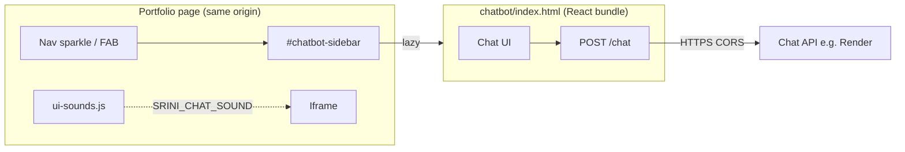

# Chatbot architecture

This document describes how the portfolio **Srini AI** chatbot is wired today in this repository: static host page, lazy-loaded iframe, hosted API, and optional UI sounds. It reflects the code in this repo; older narrative docs (e.g. RAG/Chroma/Groq pipelines) may describe alternate or historical backends not present under `backend/` here.

---

## 1. High-level system

| Layer | Role |
|--------|------|
| **Portfolio HTML** | Triggers, sidebar shell, `data-*` config, inline script to create the iframe URL and toggle `body.chat-open`. |
| **`ui-sounds.js`** | Defines `window.SRINI_CHAT_SOUND` for the iframe to call (same-origin parent). |
| **`chatbot/`** | Pre-built React (Vite) SPA: welcome screen, thread, input, suggestions; talks to the API over `fetch`. |
| **Chat API** | HTTPS service exposing `POST /chat` (and typically `GET /health`). Production default in this site: `https://srinilm.onrender.com`. |

---

## 2. Host page → iframe embedding

### DOM and CSS

- **`#chatbot-sidebar`** — Fixed panel; width animates when `body` has class **`chat-open`**. Holds the iframe once the user opens chat.
- **Triggers** — `.srini-chat-trigger` on **`.srini-chat-nav-btn`** (desktop) and **`.srini-chat-fab`** (mobile). Toggling is done by adding/removing **`chat-open`** on `<body>`.
- **Lazy load** — The `<iframe>` is created on **first open** only (`iframeLoaded` flag in the inline script), with `src` set at that moment.

### Iframe URL construction

The inline script (repeated on pages that include the chatbot) roughly does:

1. **`getAppUrl()`** — Base path to the app: `window.CHATBOT_APP_URL` if set, else `data-chatbot-src` on `#chatbot-sidebar` (default `./chatbot/`), normalized with a trailing `/`.
2. **`resolveChatApiUrl(raw)`** — If `data-chat-api` or `window.SRINI_CHAT_API` points at **`localhost` or `127.0.0.1`**, it is replaced with the public API base **`https://srinilm.onrender.com`** so deployed sites never call the visitor’s loopback by mistake.
3. **`getIframeSrc()`** — If an API base exists after resolution:  
   `{appBase}?api={encodeURIComponent(apiBase)}`  
   otherwise `{appBase}` only.

So the React app receives the API origin as the **`api`** query parameter.

### Overrides (optional)

| Mechanism | Purpose |
|-----------|---------|
| `window.CHATBOT_APP_URL` | Override chatbot static base URL (e.g. CDN). |
| `window.SRINI_CHAT_API` | Override API base string (same semantics as `data-chat-api`). |
| `data-chatbot-src` / `data-chat-api` | Per-page defaults on `#chatbot-sidebar`. |

### Closing from inside the iframe

The host listens for **`postMessage`**. If `event.data === 'srini-chat-close'`, it closes the panel. The bundled app sends that when the user closes chat from the in-iframe UI.

---

## 3. Iframe application (`chatbot/`)

### Static assets

| File | Role |
|------|------|
| `chatbot/index.html` | Shell: `#root`, DM Sans, module script + CSS. |
| `chatbot/assets/index-*.js` | Minified React bundle (currently `index-Dbje-piD.js`; hash may change on rebuild). |
| `chatbot/assets/index-*.css` | Chat UI styles. |

There is **no** React/TypeScript source in this repo—only the built output. To change UI or logic long-term, rebuild from the Vite project and replace the hashed assets + `index.html` references.

### API base resolution (inside the bundle)

- Reads **`api`** from **`window.location.search`** (URLSearchParams).
- If missing, falls back to a **default public base** (aligned with production: `https://srinilm.onrender.com`).
- **Endpoints used:**
  - **`GET {base}/health`** — Optional warm-up / readiness.
  - **`POST {base}/chat`** — JSON body `{ "message": "<user text>" }`.

### Network behavior

- **`fetch`** with **`mode: "cors"`** and a **timeout** (AbortController). Retries with backoff on timeouts, transient network `TypeError`, and some 5xx cases.
- Expects JSON response with at least **`answer`** (string) and **`suggestions`** (array; UI uses up to three follow-up chips).

### UI structure (conceptual)

- Welcome state: heading + suggestion rows (`.suggestion-row`).
- Thread: alternating user / assistant rows (`.msg-row`), bubbles (`.msg-bubble`), optional **`.msg-suggestion-btn`** under bot messages.
- Loading: typing row with dots.
- Header: info, reset, close (close triggers `postMessage` to parent).

### Parent integration: sounds

The bundle calls into the **parent window** when same-origin:

- **`parent.SRINI_CHAT_SOUND('hover')`** — On `mouseenter` of welcome and follow-up suggestion buttons (throttled on the parent side).
- **`parent.SRINI_CHAT_SOUND('answer')`** — After a successful `POST /chat` and before appending the bot message.

If `ui-sounds.js` is not loaded or `SRINI_CHAT_SOUND` is missing, calls are no-ops (wrapped in try/catch in the bundle).

---

## 4. Backend API

### Production (typical)

- Hosted over **HTTPS** with **CORS** allowing browser origins (e.g. `Access-Control-Allow-Origin: *` or explicit site origins).
- **`POST /chat`** — Request/response shape must match what the bundle expects (**`answer` + `suggestions`**), not only a single `reply` field.

### Repository reference server (`backend/server.py`)

This repo includes a small **FastAPI** app that:

- Uses **OpenAI** (`OPENAI_API_KEY`) and returns **`{ "reply": "..." }`** for `POST /chat`.

That response shape **does not** match the current iframe bundle (which expects **`answer`** and **`suggestions`**). Using it unchanged would require either adapting the server response or rebuilding the frontend. For local experiments, prefer pointing `SRINI_CHAT_API` at a service that returns the expected JSON, or extend `server.py` accordingly.

---

## 5. UI sounds (`ui-sounds.js`)

Loaded on main portfolio pages that include the chatbot (and on `zeta.html`).

| Feature | Behavior |
|---------|-----------|
| **CTA / chat open chirp** | Delegated `click` on `.srini-chat-trigger`, `.get-in-touch-btn`, `.see-more`, etc. |
| **`SRINI_CHAT_SOUND('hover')`** | Short tick; rate-limited so rapid hover does not spam. |
| **`SRINI_CHAT_SOUND('answer')`** | Short three-note chime. |
| **Accessibility** | If **`prefers-reduced-motion: reduce`**, `SRINI_CHAT_SOUND` returns without playing. |
| **Autoplay policy** | Uses **Web Audio API**; first user interaction on the page (click/touch/key) helps unlock audio on strict browsers. |

---

## 6. Security and privacy notes

- **Same-origin iframe** (e.g. `https://example.com/` and `https://example.com/chatbot/`) allows `parent.SRINI_CHAT_SOUND` without cross-origin errors.
- **Cross-origin parent** (unusual for this setup) would block parent access; sounds would silently fail.
- Visitor messages are sent to the **configured API base** only; treat that endpoint as part of your privacy posture (logging, retention, model provider).

---

## 7. Local testing

- Serve the repo root with any static server, e.g.  
  `python3 -m http.server 8765`  
  then open `http://127.0.0.1:8765/`.
- With **`resolveChatApiUrl`** + production defaults, chat usually hits the **deployed** API unless you set `window.SRINI_CHAT_API` or `data-chat-api` to a local server.
- Ensure **`ui-sounds.js`** is included after the chat sidebar script if you want sounds on that page.

---

## 8. Related files (quick index)

| Area | Files |
|------|--------|
| Host markup + iframe loader | `index.html`, `about.html`, `Google.html`, `Holachef.html`, `Zoho Sheet.html`, `zeta.html` |
| Encrypted / injected pages | `password-protect.js` (injects equivalent loader + `SRINI_CHAT_SOUND`-compatible script) |
| Sounds | `ui-sounds.js` |
| Chat static app | `chatbot/index.html`, `chatbot/assets/*` |
| Optional Python API | `backend/server.py`, `backend/requirements.txt` |
| Broader product copy / legacy stack notes | `CHATBOT.md` (may not match `backend/server.py` or Render deployment line-for-line) |

---

*Last aligned with repository layout: portfolio shell + `chatbot` static bundle + `ui-sounds.js` + optional `backend/server.py`.*
