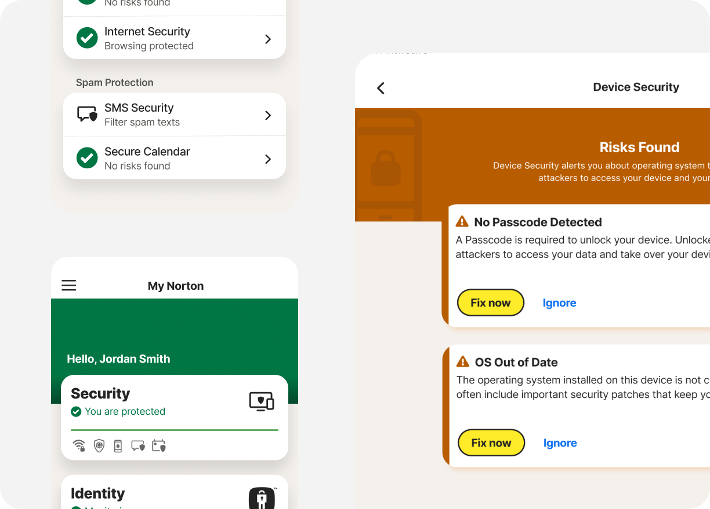

# Performance Audit — Srinivasan Portfolio

**Audited**: March 7, 2026
**URL**: https://srini-portfolio-test.netlify.app (branch: `ui-updates-chatbot-nav`)
**Overall Score**: **Needs Work**

## Executive Summary

The portfolio site has a clean, lightweight DOM (234 elements) and well-structured layout, but is held back by **unoptimized images** (95+ files over 200 KB, several over 2 MB), **469 KB of uncompressed JavaScript** (jQuery alone is 276 KB), and **16+ Google Font weights** loaded on every page. The biggest wins are image compression/format conversion (could cut 5-10 MB off page weight), removing jQuery in favor of vanilla JS, and trimming Google Font requests. These changes alone would bring LCP from an estimated 3-4s range down to under 2.5s.

## Asset Summary

| Category | Count | Total Size | Status |
|----------|-------|-----------|--------|
| HTML | 2 pages | ~55 KB (index) | OK |
| CSS (external) | 3 files | ~44 KB | OK |
| CSS (inline) | 3 blocks | ~28 KB | Warning — 25 KB block |
| JavaScript | 3 files | ~469 KB | Critical — over 250 KB |
| Images (index page) | 6 referenced | ~11 MB | Critical — all oversized |
| Images (total repo) | 120+ files | ~90 MB+ | Critical |
| Fonts (local) | 5 TTF files | ~340 KB | Warning |
| Fonts (Google) | 5 families, 14 weights | ~200 KB+ (est.) | Critical — too many |
| **Total (index page load)** | | **~12 MB+ estimated** | **Critical** |

## Findings

### Critical (fix first)

| # | Finding | Impact | File(s) |
|---|---------|--------|---------|
| 1 | **6 hero/card images are 1-2 MB each (PNG, no compression)** — `Intuit.png` (2.2 MB), `API.png` (2.2 MB), `Norton.png` (2.0 MB), `holachef.png` (1.9 MB), `sample.png` (820 KB) | LCP 3-4s+, massive page weight | `images/Intuit.png`, `images/API.png`, `images/Norton.png`, `images/holachef.png`, `images/sample.png` |
| 2 | **jQuery 276 KB loaded synchronously** — blocks parsing, only used for smooth scroll, hamburger menu, and tilt effect | Adds ~300ms+ parse/execute time | `index.html` line 1436 |
| 3 | **16+ Google Font weights loaded** — 5 families (Work Sans, Press Start 2P, Departure Mono, Space Mono, DM Sans) with 14 combined weights | Each font request blocks rendering; ~200 KB+ download | `index.html` lines 43-47 |
| 4 | **6 render-blocking stylesheets** in `<head>` — 1 local + 5 Google Fonts links without `media` or `preload` | Blocks first paint until all CSS downloaded | `index.html` lines 27, 43-47 |
| 5 | **No images use `loading="lazy"`** — all 6 content images load eagerly including below-fold cards | All images download on initial load | `index.html` lines 1164-1401 |
| 6 | **No images have `width`/`height` attributes** — causes layout shift when images load | CLS > 0.1 | `index.html` lines 1164-1401 |
| 7 | **AOS library loaded from rawgit.com** — rawgit is deprecated/unreliable; script loaded without `defer` | Unreliable CDN + render-blocking | `index.html` line 1438 |

### Warnings

| # | Finding | Impact | File(s) |
|---|---------|--------|---------|
| 1 | **25 KB inline `<style>` block** — large block that can't be cached separately | Re-downloaded on every page load | `index.html` (block 2, lines ~50-1050) |
| 2 | **Local @font-face rules missing `font-display: swap`** — `MyWebFont`, `MyWebFont1` | Text invisible during font load (FOIT) | `style.css` lines 57-64 |
| 3 | **No font preloading** for local TTF files — 5 files totaling 340 KB | Late font discovery delays text rendering | `fonts/` directory |
| 4 | **7 elements use `backdrop-filter: blur()`** — floating nav, read-more buttons, see-more button, get-in-touch button, chat FAB | GPU-intensive on scroll/repaint | `index.html` inline styles |
| 5 | **No images use `srcset` or responsive sizes** | Full-size images served to all devices | `index.html` |
| 6 | **All images are PNG format** — no WebP/AVIF | PNGs 2-5x larger than WebP equivalents | `images/` directory |
| 7 | **Duplicate `.sample` selector** defined 3 times in `style.css` with near-identical rules | Maintenance confusion, wasted bytes | `style.css` lines 405, 425, 439 |
| 8 | **`<html>` missing `lang` attribute** on both pages | Accessibility/SEO issue | `index.html`, `about.html` |
| 9 | **Universal `*` selectors** in CSS | Minor perf cost on style recalculation | `style.css` lines 66, 318 |
| 10 | **jquery.cycle2.js (48 KB) loaded but unused** on index page | Wasted bandwidth | Root directory |

### Passed Checks

- DOM element count is low (234) — well under 1500 threshold
- Viewport meta tag is present
- No `@import` statements in CSS
- No `document.write()` usage
- Google Fonts CSS uses `display=swap` in URL parameters
- Chatbot iframe is lazy-loaded (created dynamically on first open)
- Google Analytics script uses `async`
- SVGs used for icons (check marks, social icons)
- Total external CSS under 100 KB (44 KB)
- No deep CSS nesting (max 3 levels)
- Console is clean — no JavaScript errors or warnings

## Core Web Vitals Estimate

| Metric | Estimate | Rating | Key Factor |
|--------|----------|--------|------------|
| **LCP** | ~3.5s | Needs Work | Hero images 2+ MB (PNG), 6 render-blocking stylesheets, no lazy loading |
| **CLS** | ~0.2 | Needs Work | All 6 images missing `width`/`height`, late-loading custom fonts without `font-display: swap` |
| **INP** | ~150ms | Good | Light DOM, minimal JS event handlers (jQuery scroll + tilt) |
| **TTFB** | ~100ms | Good | Netlify CDN, static HTML serving |

## Recommendations (prioritized)

### High Impact

1. **Convert and compress images to WebP** — The 6 images on index.html total ~11 MB as PNG. Converting to WebP at 80% quality would reduce this to ~1-2 MB total.

```bash
# Example using cwebp (install via: brew install webp)
for img in images/Intuit.png images/API.png images/Norton.png images/Google1.png images/sample.png images/holachef.png; do
  cwebp -q 80 "$img" -o "${img%.png}.webp"
done
```

Then use `<picture>` with fallback:
```html
<picture>
  <source srcset="images/Intuit.webp" type="image/webp">
  
</picture>
```

2. **Replace jQuery with vanilla JS** — jQuery is 276 KB and used for 4 simple tasks. Vanilla equivalents:

```javascript
// Smooth scroll (replaces jQuery smooth scroll)
document.querySelectorAll('a[href^="#"]').forEach(a => {
  a.addEventListener('click', e => {
    e.preventDefault();
    document.querySelector(a.getAttribute('href'))
      ?.scrollIntoView({ behavior: 'smooth' });
  });
});
```

3. **Reduce Google Font requests** — Load only the weights actually used (likely 400 and 600-700 of 1-2 families). Remove unused families.

```html
<!-- Before: 5 families, 14 weights -->
<!-- After: 2 families, 4 weights -->
<link href="https://fonts.googleapis.com/css2?family=DM+Sans:wght@400;600&family=Work+Sans:wght@400;600&display=swap" rel="stylesheet">
```

4. **Add `loading="lazy"` and dimensions to all images**:

```html
<!-- Before -->


<!-- After -->

```

5. **Add `defer` to jQuery and AOS scripts** (if keeping them):

```html
<script src="https://code.jquery.com/jquery-3.2.1.min.js" defer></script>
<script src="https://cdn.jsdelivr.net/npm/aos@2.3.4/dist/aos.js" defer></script>
```

### Medium Impact

6. **Add `font-display: swap` to local @font-face rules** in `style.css`:

```css
@font-face {
  font-family: 'MyWebFont';
  src: url('fonts/Product Sans Regular.ttf');
  font-display: swap;
}
```

7. **Preload critical local fonts**:

```html
<link rel="preload" href="fonts/Product Sans Regular.ttf" as="font" type="font/ttf" crossorigin>
```

8. **Extract the 25 KB inline `<style>` block** to an external cached CSS file.

9. **Add `<html lang="en">` attribute** to both `index.html` and `about.html`.

10. **Replace rawgit.com AOS CDN** with a reliable CDN:

```html
<script src="https://cdn.jsdelivr.net/npm/aos@2.3.4/dist/aos.js" defer></script>
```

### Low Impact / Nice-to-Have

11. **Add responsive `srcset`** to card images for mobile devices (serve smaller images on phones).

12. **Remove `jquery.cycle2.js`** (48 KB) if unused on the current site.

13. **Consolidate duplicate `.sample` CSS rules** in `style.css` into a single rule with media query overrides.

14. **Consider removing `backdrop-filter`** from the floating nav on mobile devices where GPU performance is more constrained.

15. **Preconnect to Google Fonts** is already done — ensure it's before the font stylesheet link.

---

*This is a point-in-time assessment. Re-run after implementing changes to measure progress.*
