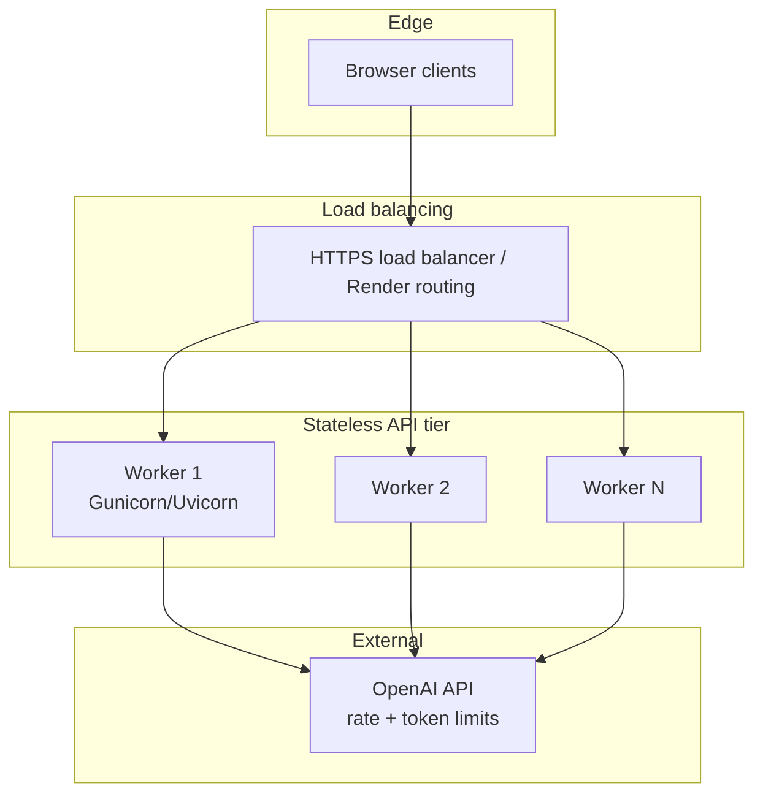

# Chat API scalability (≈1000 requests per minute)

This document analyzes the FastAPI service in `server.py` and describes how to run it at roughly **1000 successful chat requests per minute** (~16.7 RPS sustained) while staying within OpenAI limits and predictable latency.

## Current backend (summary)

| Mechanism | Role |
|-----------|------|
| **Gunicorn + Uvicorn workers** | Multiple OS processes; each runs an asyncio event loop and handles many concurrent connections. |
| **`asyncio.Semaphore` (`CHAT_MAX_CONCURRENT`)** | Caps concurrent **in-flight OpenAI** calls **per worker** so bursts do not exhaust API quota or memory. |
| **slowapi (per-IP)** | Sliding-window limit (default **30/minute per client IP per worker**) to reduce abuse; configurable via `RATE_LIMIT_PER_IP`. |
| **OpenAI-compatible client** | Groq (default), OpenAI, or Ollama — configurable timeouts/retries (`LLM_TIMEOUT_SEC` / legacy `OPENAI_*` env names). |
| **`POST /chat` response** | `{ "answer", "reply", "suggestions" }` — compatible with the static iframe bundle (`answer` + `suggestions`). |

Per-IP limits are **in-memory per worker**. They are **not** shared across workers or instances without a shared store (Redis).

## Target load: 1000 RPM

- **1000 RPM** ≈ **16.67 requests/second** if evenly spread.
- LLM latency dominates (often **1–5+ seconds** per call). Rough capacity planning:

\[
\text{needed concurrency} \approx \text{RPS} \times \text{average latency (seconds)}
\]

Example: 17 RPS × 3 s ≈ **51** concurrent OpenAI calls **at the steady state** (not counting queueing).

So a **single-threaded** single worker cannot sustain 1000 RPM unless each request finishes in under about **60 ms** — unrealistic for chat completions. You need **multiple workers and/or multiple instances** plus enough `CHAT_MAX_CONCURRENT` headroom.

## Reference architecture (horizontal scale)

**Principles:**

1. **Stateless app servers** — no session affinity required for chat; any worker can serve any request.
2. **Scale out** — increase **worker count** (`WEB_CONCURRENCY` / gunicorn `-w`) and/or **instance count** (Render: scale replicas; other clouds: multiple VMs/containers behind a load balancer).
3. **Match OpenAI tier** — raise organization **RPM/TPM** limits to match real traffic; the app semaphore only protects a single process, not your global OpenAI quota.
4. **Tune `CHAT_MAX_CONCURRENT`** per worker so that `workers × CHAT_MAX_CONCURRENT` is in line with expected concurrent LLM calls and provider limits (avoid runaway parallelism).

## Suggested starting point for ~1000 RPM

These are **starting points**; measure P95 latency and OpenAI 429s, then adjust.

| Knob | Example | Notes |
|------|---------|--------|
| Gunicorn workers | **4–8** per instance | CPU-bound Python workers; more workers ⇒ more memory. |
| Instances / replicas | **2+** if one node is not enough | Split traffic; doubles per-IP limit **effective** windows unless you add Redis (see below). |
| `CHAT_MAX_CONCURRENT` | **24–48** per worker | Higher if OpenAI account allows; lower if you see memory pressure. |
| `RATE_LIMIT_PER_IP` | **30/minute** (default) | Stops one IP from monopolizing; **not** a substitute for OpenAI-side limits. |
| OpenAI account | Paid tier with **RPM/TPM** headroom | Required for sustained production load. |

**Order-of-magnitude check:** 4 workers × 32 concurrent ≈ **128** in-flight calls **per instance** at peak internal parallelism (upper bound; semaphore + latency shape actual usage). If average latency is 2 s, that cluster can absorb on the order of **64 RPS** theoretical steady-state before queueing dominates — well above 17 RPS **if** the provider keeps up. Real limits are usually **OpenAI rate limits** and **instance CPU/RAM**.

## Per-IP rate limiting across many servers

slowapi’s default storage is **in-process memory**. With **multiple instances**, each instance tracks its own counters, so a client could send **N × limit** requests to **N** instances unless:

- You terminate TLS at one edge and enforce limits there (API gateway, Cloudflare, etc.), or
- You use a **shared backend** for rate limits (e.g. Redis with `limits` + Redis storage) — not implemented in this repo; add if you need strict global or per-IP caps.

## Operations checklist

- **Health checks** — `GET /health` for load balancer readiness.
- **Timeouts** — gunicorn `--timeout` ≥ worst-case LLM latency; align with `OPENAI_TIMEOUT_SEC`.
- **Observability** — log 429/5xx, latency histograms, and OpenAI errors; alert on sustained errors.
- **Cold starts** — serverless-style hosts may spin down idle instances; use minimum instances or keep-alive if P99 matters.

## Files

| File | Purpose |
|------|---------|
| `server.py` | API, concurrency gate, per-IP limit, OpenAI call |
| `Procfile` | Gunicorn + Uvicorn workers for production |
| `../render.yaml` | Example Render web service (root `rootDir: backend`) |
| `.env.example` | Environment variables for tuning |

---

*Capacity numbers are estimates; validate with load tests against your deployed region and OpenAI project limits.*
